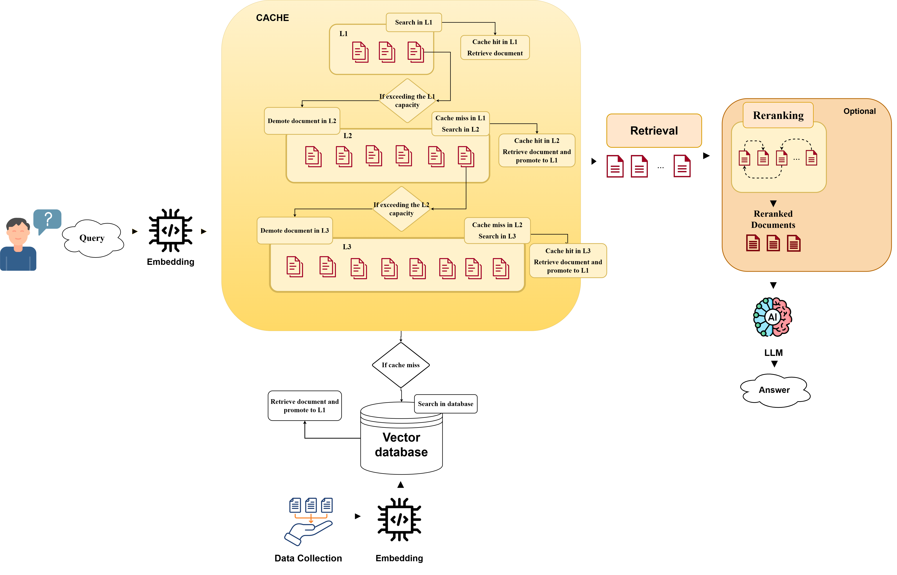

# HieRAG – Hierarchical Retrieval-Augmented Generation



## Descrizione

**HieRAG** è un sistema di Retrieval-Augmented Generation (RAG) ottimizzato tramite una **cache gerarchica a tre livelli** (L1, L2, L3), progettato per ridurre i tempi di accesso alle informazioni e migliorare l'efficienza nel retrieval documentale.

Il sistema supporta opzionalmente un **reranker** a seconda sesi vuole utilizzare HieRAG con la sua versione standard o HieRAG++ con il reranker e utilizza un **Large Language Model (LLM)** per generare risposte a partire da documenti rilevanti.

---

## Dataset utilizzati

Il sistema è stato sperimentato e validato su tre dataset:

- 🧪 **PubMedQA** (ambito biomedico)
- 📖 **SQuAD** (domande in linguaggio naturale su Wikipedia)
- 🧠 **HotPotQA** (ragionamento multi-hop su più documenti)

---

## Parametri sperimentati

Durante la sperimentazione sono stati testati diversi valori per:

- **Numero di documenti retrievati** per query
- **Numero di livelli** di cache (da 1 a 3)
- **Capacità di ciascun livello** L1, L2, L3 (250 per L1; 500 per L2; 1000 per L3) / (25 per L1; 50 per L2; 100 per L3) / (25 per L1)

---

## Architettura

1. La **query** viene trasformata in un embedding vettoriale.
2. Il sistema ricerca in **cache** a tre livelli:
   - Se cache hit in L1, documento restituito subito.
   - Se cache miss, si cerca in L2
   - Se cache hit in L2, il documento viene restituito e promosso in L1
   - Se cache miss in L2, si cerca in L3.
   - Se cache hit in L3, il documento viene restituito e promosso in L1
   - Se cache miss completa, si accede al **vector database** (FAISS, etc.).
3. I documenti rilevanti possono essere **rerankati** se stiamo parlando di HieRAG++ atrimenti i documenti vengono passati nella finestra di contesto del **LLM**.
4. Un **LLM** genera la risposta finale.

---

## File principali

- `HieRAG_PubMedQA.ipynb`: notebook principale con il codice del sistema HieRAG, testato su PubMedQA.
- `HieRAG_HotPotQA.ipynb`: notebook principale con il codice del sistema HieRAG, testato su HotPotQA.
- `HieRAG_SQuDA.ipynb`: notebook principale con il codice del sistema HieRAG, testato su SQuAD.
- `hierag.png`: schema architetturale del sistema.

---

## Requisiti

Per eseguire il notebook, assicurati di avere installato:

```bash
pip install faiss-cpu sentence-transformers scikit-learn transformers
